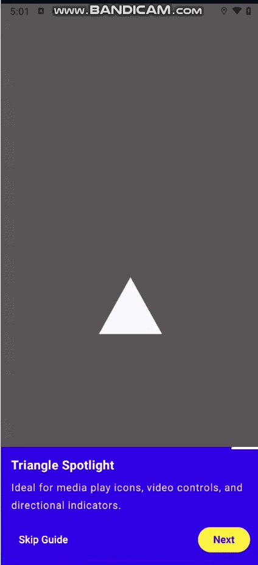

# 🔦 Spotly Onboarding

> A modern, dynamic, and customizable onboarding spotlight library for **Jetpack Compose** — featuring smooth shape morphing animations, multi-target highlighting, and a fully declarative API.

[](https://developer.android.com/studio)
[](https://kotlinlang.org)
[](https://developer.android.com/jetpack/compose)
[](https://opensource.org/licenses/MIT)

---

## ✨ Overview

**Spotly Onboarding** is a lightweight and highly customizable onboarding spotlight library built entirely with **Jetpack Compose**.

It allows you to create interactive product tours and feature walkthroughs by highlighting UI elements with different geometric shapes.

Spotly is designed around a declarative architecture and provides smooth animated transitions between spotlight shapes, making onboarding experiences feel natural and polished.



### Why Spotly?

* 🎯 Highlight one or multiple targets per step
* 🔄 Smooth morphing animations between different shapes
* 🎨 Fully customizable colors and UI text
* 📐 Multiple built-in geometric shapes
* 🧩 Declarative Compose-first API
* 🚀 No legacy Android View dependencies
* ⚡ Lightweight and performance-oriented
* 🛠️ Simple state management
* 🔧 Easy to extend with custom shapes

---

## 🚀 Features

### 🔄 Shape Morphing

Spotly smoothly animates between different spotlight geometries using spring-based animations.

```kotlin
Spring.StiffnessLow
```

This allows transitions such as:

```text
Circle → Star → Polygon → RoundedRect
```

without abrupt changes between onboarding steps.

---

### 📐 Built-in Shape Engine

Spotly currently supports:

| Shape           | Customization                      |
| --------------- | ---------------------------------- |
| `Circle`        | Radius                             |
| `RoundedRect`   | Width, height, corner radius       |
| `Oval`          | Width, height                      |
| `Capsule`       | Width, height                      |
| `CutCornerRect` | Width, height, cut size            |
| `Star`          | Radius, points, inner radius ratio |
| `Triangle`      | Width, height                      |
| `Polygon`       | Radius, number of sides            |

---

### 🎯 Multi-Target Spotlight

Multiple UI elements can be highlighted within a single onboarding step.

```kotlin
GuideStep(
    title = "Multiple Targets",
    description = "Highlight multiple elements at the same time.",
    spotlights = listOf(
        SpotlightShape(
            offsetDp = DpOffset(60.dp, 100.dp),
            shape = TargetShape.Circle(
                radiusDp = 28.dp
            )
        ),
        SpotlightShape(
            offsetDp = DpOffset(300.dp, 100.dp),
            shape = TargetShape.Capsule(
                widthDp = 80.dp,
                heightDp = 36.dp
            )
        )
    )
)
```

---

## 🏗️ Architecture

Spotly follows a clean declarative architecture built specifically for Jetpack Compose.

```text
┌───────────────────────────────┐
│        SpotlyGuideManager     │
│                               │
│   Step / State Management     │
└───────────────┬───────────────┘
                │
                ▼
┌───────────────────────────────┐
│           GuideStep           │
│                               │
│   Title / Description /        │
│   Spotlight Targets           │
└───────────────┬───────────────┘
                │
                ▼
┌───────────────────────────────┐
│        TargetShape Engine     │
│                               │
│ Circle / Star / Polygon /     │
│ RoundedRect / Capsule / ...   │
└───────────────┬───────────────┘
                │
                ▼
┌───────────────────────────────┐
│       Compose Canvas          │
│                               │
│   Animated Spotlight Overlay  │
└───────────────────────────────┘
```

The library separates onboarding state from rendering, keeping your UI code clean and predictable.

---

# 📦 Installation

Add the Spotly Onboarding dependency to your app-level build.gradle.kts file:

dependencies {
    implementation("io.github.bahar-developer:spotly-onboarding:1.0.0")
}

Then sync your project with Gradle.

Requirements: Kotlin 2.0+ and Jetpack Compose 1.7+

> Replace `<version>` with the latest released version.

---

# 🚀 Getting Started

## 1. Create Your Onboarding Steps

After adding the dependency, you can import Spotly components and create your onboarding flow.
```kotlin
val steps = listOf(
    GuideStep(
        title = "Welcome to Spotly",
        description = "Discover the most important features of your application.",
        spotlights = listOf(
            SpotlightShape(
                offsetDp = DpOffset(
                    x = 180.dp,
                    y = 200.dp
                ),
                shape = TargetShape.Circle(
                    radiusDp = 60.dp
                )
            )
        )
    )
)
```

---

## 2. Add `SpotlyGuideManager`

Use Compose state to control the current onboarding step:

```kotlin
@Composable
fun SpotlyDemoScreen() {

    var currentIndex by remember {
        mutableIntStateOf(0)
    }

    val steps = remember {
        OnboardingSample.getSampleSteps()
    }

    SpotlyGuideManager(
        steps = steps,
        currentStepIndex = currentIndex,

        onNextStep = {
            if (currentIndex < steps.lastIndex) {
                currentIndex++
            }
        },

        onPreviousStep = {
            if (currentIndex > 0) {
                currentIndex--
            }
        },

        onSkipOrFinish = {
            // Handle onboarding completion
        },

        colors = SpotlyColors(
            containerBackground = Color(0xFF3200EE),
            buttonBackgroundColor = Color(0xFFFFEB3B),
            buttonTextColor = Color(0xFF3200EE)
        ),

        skipText = "Skip Guide",
        finishText = "Finish",
        nextText = "Next",
        previousText = "Previous"
    )
}
```

---

# 🎨 Custom Shapes

## Circle

Perfect for avatars, FABs, and circular icons.

```kotlin
TargetShape.Circle(
    radiusDp = 60.dp
)
```

---

## Rounded Rectangle

Ideal for cards, banners, and containers.

```kotlin
TargetShape.RoundedRect(
    widthDp = 300.dp,
    heightDp = 110.dp,
    cornerRadiusDp = 16.dp
)
```

---

## Oval

Useful for horizontally or vertically stretched components.

```kotlin
TargetShape.Oval(
    widthDp = 180.dp,
    heightDp = 90.dp
)
```

---

## Capsule

Great for pills, chips, tags, and fully rounded buttons.

```kotlin
TargetShape.Capsule(
    widthDp = 160.dp,
    heightDp = 48.dp
)
```

---

## Star

Useful for ratings, favorites, achievements, and gamification.

```kotlin
TargetShape.Star(
    radiusDp = 60.dp,
    points = 5,
    innerRadiusRatio = 0.45f
)
```

---

## Triangle

Useful for directional controls and media actions.

```kotlin
TargetShape.Triangle(
    widthDp = 100.dp,
    heightDp = 90.dp
)
```

---

## Polygon

Create polygons with a configurable number of sides.

```kotlin
TargetShape.Polygon(
    radiusDp = 60.dp,
    sides = 6
)
```

For example:

```text
sides = 3  → Triangle
sides = 5  → Pentagon
sides = 6  → Hexagon
sides = 8  → Octagon
```

---

## Cut Corner Rectangle

Useful for modern, angular, and distinctive UI designs.

```kotlin
TargetShape.CutCornerRect(
    widthDp = 300.dp,
    heightDp = 100.dp,
    cutSizeDp = 16.dp
)
```

---

# 🧩 Complete Example

The following example demonstrates several Spotly capabilities in a single onboarding flow:

```kotlin
object OnboardingSample {

    fun getSampleSteps(
        screenWidthDp: Float
    ): List<GuideStep> {

        val centerX = (screenWidthDp / 2).dp

        return listOf(

            GuideStep(
                title = "Triangle Spotlight",
                description = "Highlight media controls and directional actions.",
                spotlights = listOf(
                    SpotlightShape(
                        offsetDp = DpOffset(
                            x = centerX,
                            y = 480.dp
                        ),
                        shape = TargetShape.Triangle(
                            widthDp = 100.dp,
                            heightDp = 90.dp
                        )
                    )
                )
            ),

            GuideStep(
                title = "Polygon Spotlight",
                description = "Perfect for badges, achievements, and custom avatars.",
                spotlights = listOf(
                    SpotlightShape(
                        offsetDp = DpOffset(
                            x = centerX,
                            y = 340.dp
                        ),
                        shape = TargetShape.Polygon(
                            radiusDp = 60.dp,
                            sides = 6
                        )
                    )
                )
            ),

            GuideStep(
                title = "Star Spotlight",
                description = "Great for ratings, favorites, and featured items.",
                spotlights = listOf(
                    SpotlightShape(
                        offsetDp = DpOffset(
                            x = centerX,
                            y = 200.dp
                        ),
                        shape = TargetShape.Star(
                            radiusDp = 60.dp,
                            points = 5,
                            innerRadiusRatio = 0.45f
                        )
                    )
                )
            ),

            GuideStep(
                title = "Circle Spotlight",
                description = "Ideal for avatars, FABs, and circular icons.",
                spotlights = listOf(
                    SpotlightShape(
                        offsetDp = DpOffset(
                            x = centerX,
                            y = 180.dp
                        ),
                        shape = TargetShape.Circle(
                            radiusDp = 60.dp
                        )
                    )
                )
            ),

            GuideStep(
                title = "Rounded Rectangle",
                description = "Designed for cards, banners, and message containers.",
                spotlights = listOf(
                    SpotlightShape(
                        offsetDp = DpOffset(
                            x = centerX,
                            y = 300.dp
                        ),
                        shape = TargetShape.RoundedRect(
                            widthDp = (screenWidthDp - 48).dp,
                            heightDp = 110.dp,
                            cornerRadiusDp = 16.dp
                        )
                    )
                )
            ),

            GuideStep(
                title = "Oval Spotlight",
                description = "Useful for logos and horizontally stretched controls.",
                spotlights = listOf(
                    SpotlightShape(
                        offsetDp = DpOffset(
                            x = centerX,
                            y = 420.dp
                        ),
                        shape = TargetShape.Oval(
                            widthDp = 180.dp,
                            heightDp = 90.dp
                        )
                    )
                )
            ),

            GuideStep(
                title = "Capsule Spotlight",
                description = "Perfect for chips, tags, and pill-shaped buttons.",
                spotlights = listOf(
                    SpotlightShape(
                        offsetDp = DpOffset(
                            x = centerX,
                            y = 520.dp
                        ),
                        shape = TargetShape.Capsule(
                            widthDp = 160.dp,
                            heightDp = 48.dp
                        )
                    )
                )
            ),

            GuideStep(
                title = "Cut Corner Spotlight",
                description = "A great fit for angular and modern UI designs.",
                spotlights = listOf(
                    SpotlightShape(
                        offsetDp = DpOffset(
                            x = centerX,
                            y = 620.dp
                        ),
                        shape = TargetShape.CutCornerRect(
                            widthDp = (screenWidthDp - 64).dp,
                            heightDp = 100.dp,
                            cutSizeDp = 16.dp
                        )
                    )
                )
            ),

            GuideStep(
                title = "Multi-Spotlight",
                description = "Highlight multiple UI elements in a single step.",
                spotlights = listOf(

                    SpotlightShape(
                        offsetDp = DpOffset(
                            x = 60.dp,
                            y = 100.dp
                        ),
                        shape = TargetShape.Circle(
                            radiusDp = 28.dp
                        )
                    ),

                    SpotlightShape(
                        offsetDp = DpOffset(
                            x = screenWidthDp.dp - 60.dp,
                            y = 100.dp
                        ),
                        shape = TargetShape.Capsule(
                            widthDp = 80.dp,
                            heightDp = 36.dp
                        )
                    )
                )
            )
        )
    }
}
```

---

# 🎬 Animation

Spotly uses animated transitions to smoothly transform the spotlight between onboarding steps.

For example:

```text
     ●
     │
     ▼
    ★
     │
     ▼
    ⬡
     │
     ▼
   ┌─────┐
   │     │
   └─────┘
```

The spotlight geometry can change while the transition remains fluid, creating a more polished onboarding experience.

---

# 🎨 Customization

Spotly provides customization for the onboarding UI through `SpotlyColors`.

```kotlin
SpotlyColors(
    containerBackground = Color(0xFF3200EE),
    buttonBackgroundColor = Color(0xFFFFEB3B),
    buttonTextColor = Color(0xFF3200EE)
)
```

You can also customize the navigation labels:

```kotlin
skipText = "Skip Guide"
previousText = "Previous"
nextText = "Next"
finishText = "Finish"
```

---

# 🧠 Design Philosophy

Spotly is built around three principles:

### 1. Compose First

No dependency on the legacy Android View system.

### 2. Declarative

Define what the onboarding experience should look like and let Compose handle rendering and state updates.

### 3. Extensible

The spotlight architecture is designed so new shapes and customization options can be added without changing the core onboarding flow.

---

# 📋 Supported Shapes

```text
TargetShape
├── Circle
├── RoundedRect
├── Oval
├── Capsule
├── CutCornerRect
├── Star
├── Triangle
└── Polygon
```

---

# 🛠️ Requirements

* **Android Studio:** 2024.1+
* **Kotlin:** 2.0+
* **Jetpack Compose:** 1.7+
* **Minimum Android version:** See project configuration

---

# 🗺️ Roadmap

Potential future improvements:

* [ ] Custom user-defined spotlight shapes
* [ ] Automatic target positioning
* [ ] Target composable registration
* [ ] More animation presets
* [ ] Overlay blur effects
* [ ] Custom transition specifications
* [ ] Accessibility improvements
* [ ] RTL layout support
* [ ] More onboarding UI customization
* [ ] Compose Multiplatform support

---

# 🤝 Contributing

Contributions, suggestions, and issue reports are welcome.

If you have an idea for improving Spotly:

1. Fork the repository
2. Create a feature branch
3. Make your changes
4. Add or update tests where appropriate
5. Open a Pull Request

For larger changes, consider opening an issue first to discuss the proposed approach.

---

# 🐛 Issues & Feature Requests

Found a bug or have an idea?

Please open an issue and include:

* Android Studio version
* Kotlin version
* Compose version
* Android API level
* Minimal reproduction steps
* Expected behavior
* Actual behavior

Screenshots or screen recordings are highly appreciated for UI-related issues.

---

# 📄 License

Spotly Onboarding is released under the **MIT License**.

See the [LICENSE](LICENSE) file for details.

---

## ⭐ Support the Project

If Spotly helps you build better onboarding experiences, consider giving the repository a ⭐ on GitHub.

It helps the project grow and makes it easier for other Android developers to discover it.

---

## 🔦 Spotly

**Build better onboarding experiences with Jetpack Compose.**

> Highlight. Explain. Guide. ✨
